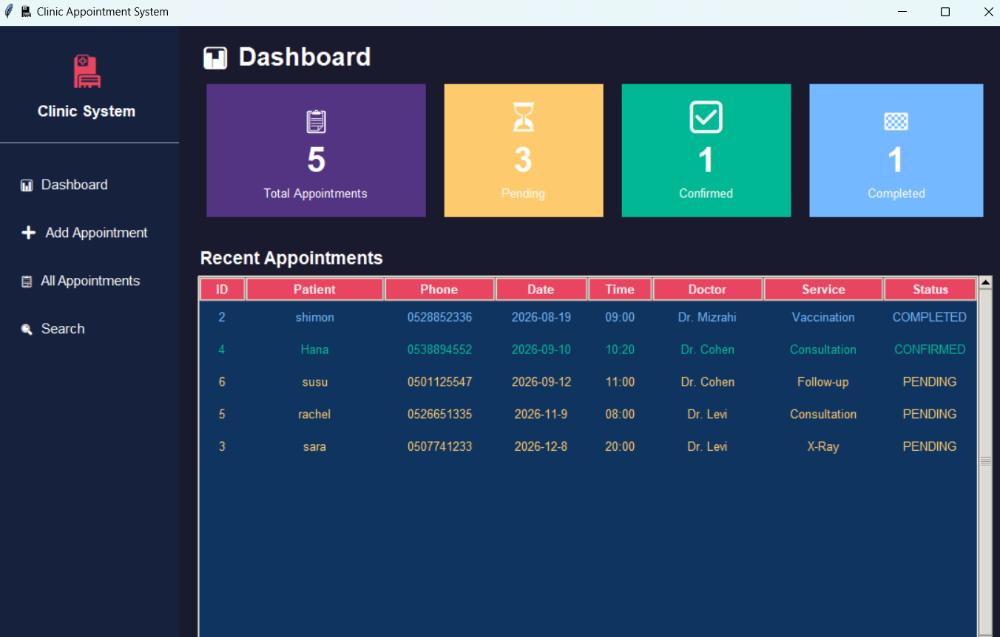

# 🏥 Clinic Appointment System

A Python-based appointment management system for a medical clinic, using SQLite for persistent data storage.

**Submitted by:** Noga Rosenberg

## Screenshot

## What Was Implemented

### Core Features (Required):

* ✅ Add new appointment (patient name, phone, date, time, doctor, service type)
* ✅ View all appointments
* ✅ View appointments by date
* ✅ Search appointments by patient name
* ✅ Update appointment status (pending / confirmed / completed / cancelled)
* ✅ Delete appointment with confirmation
* ✅ Basic conflict detection (warning if same doctor/date/time)
* ✅ Input validation (empty fields not allowed)
* ✅ Error handling with try/except throughout

### Bonus Features:

* ❌ Customer management and invoices (not implemented)
* ❌ Lead management (not implemented)

## How to Run

### Command-line version

1. Make sure Python 3 is installed
2. Open terminal in the project folder
3. Run:
